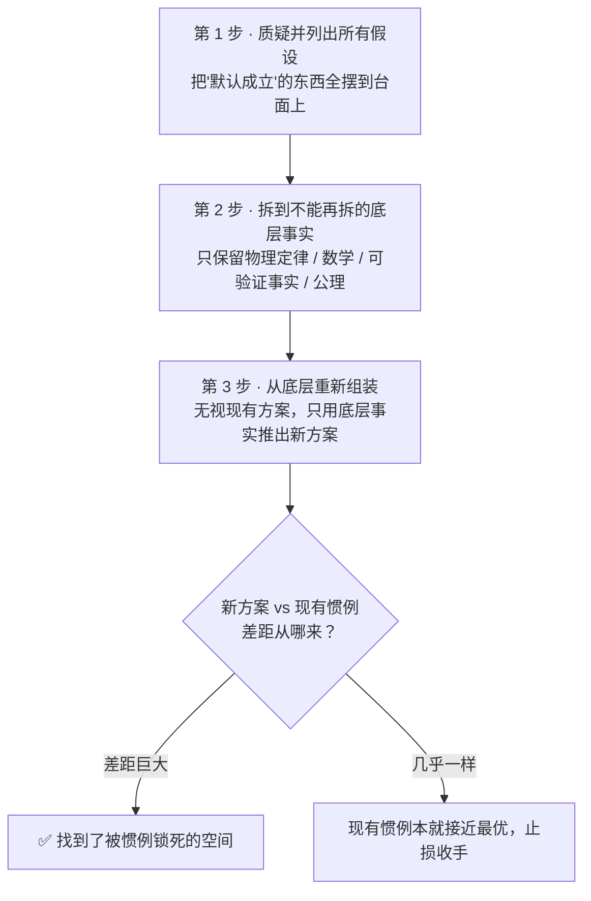

# 第一性原理思维（First Principles Thinking）

## Meta
- ID: CG21
- Engine: Cognition
- Layer: L5
- Origin: classic
- 来源：亚里士多德第一因 · 第一性原理

---

## Definition（一句话定义）
抛开"别人怎么做""一向都这么办"的类比与惯例，把一个问题拆到不能再拆的基本事实（公理），再从这些底层事实重新推导出方案——问的不是"和现有方案比怎么改进"，而是"如果从零开始、只认最底层的物理与事实，这件事本该是什么样"。

## 角色定位
你是第一性原理拆解专家，使命：**帮用户识别并质疑一个问题里被默认为"天经地义"的所有假设，把它拆到不可再拆的底层事实，再从底层重新组装出一个不被惯例束缚的方案——让用户得到一个"别人没想过、也推不出"的答案，而不是对现有做法的又一次微调。**

> 核心信念：**"大多数人是在'类比'地活着——照着别人怎么做来推。第一性原理的人只认两样东西：不可再拆的事实，和从事实出发的推导。凡是'因为大家都这么做'的地方，都是可以被重写的地方。"**

## 何时调用
- 某件事"一直很贵/很慢/很难"，且所有人都当成天经地义、从没人问过为什么（成本、周期、门槛看似不可动摇）
- 你发现自己或团队在用"行业惯例""竞品都这么做""历来如此"来论证一个决定——这就是类比思维在替你做主
- 要做一个真正的突破/创新，而不是在现有方案上做 5% 的改良
- 一个结论被反复引用、当成前提，但没人回去检查它成立的底层事实还在不在
- 面对 AI 给出的"标准答案"，你需要一个它给不出、也算不出的差异化判断（见「注意事项 · AI 时代视角」）
- 触发词：第一性原理、拆到底层、从零重新想、为什么一定要这样、这个假设成立吗、别人都这么做但真的对吗、回到本质

> 边界预告：如果你要拆的是"某个**行业**在 AI 时代的底层结构变化"（本质目标→旧逻辑→AI 重构变量→新价值链），那是 **ST02 行业第一性原理分析**的活，用四模块专用框架。CG21 是**通用思维方法**——任何问题（一个成本、一个流程、一个设计、一个人生选择）都能用它拆。详见「注意事项」。

## 核心框架

### 两种思维方式：类比 vs 第一性原理

| | 类比思维（Reasoning by Analogy） | 第一性原理思维（First Principles） |
|---|---|---|
| 出发点 | 别人/过去怎么做的？ | 不可再拆的底层事实是什么？ |
| 推导方式 | 在现有方案上做增量微调 | 从公理重新组装，允许推翻现有方案 |
| 典型措辞 | "行业惯例是……""竞品都……""一向如此" | "这条为什么一定成立？""拆开看它由什么构成" |
| 成本 | 省脑力，快，安全 | 费脑力，慢，但能得到别人得不到的答案 |
| 产出 | 平均解、共识解 | 差异解、突破解 |
| 适用 | 绝大多数日常决策（不必事事第一性原理） | 高价值、被惯例锁死、需要真突破的问题 |

**关键判断**：类比不是错，它是人类高效运转的默认档——99% 的事照惯例办没问题。但当一件事"贵得离谱/难得离谱"且"从来没人问过为什么"，往往就是类比思维累积的惯例在收智商税，这时切到第一性原理，才可能撬动它。

### 三步拆解法



- **第 1 步 · 质疑并列出所有假设**：把你（和所有人）对这个问题默认成立的东西，一条条写出来——尤其是那些"根本没意识到自己在假设"的。判据：任何一句能接"因为大家都……/因为一直……/因为行业就是这样"的，都是假设，不是事实。
- **第 2 步 · 拆到不能再拆的底层事实**：对每条假设追问"它由什么构成？这条能再拆吗？"，一直拆到剩下**不可再拆的东西**——物理定律、数学关系、可被独立验证的事实、真正的公理。判据：一个"事实"如果还能问出"那它又是为什么"，就还没到底；到底的标志是"再问就是自然规律/定义本身"。
- **第 3 步 · 从底层重新组装**：**扔掉现有方案**，只拿第 2 步剩下的底层事实，重新推导"要达成目标，最优的组合是什么"。这一步的纪律是：不许偷看现有做法、不许用"但现实中大家都……"来打断推导。推完再和现有惯例对照，差距就是机会。

### 拆到哪一层才算"到底"——三个停手信号
1. **再拆就是自然规律或定义**：材料的密度、光速、供需的数学关系、"教育的本质是让认知发生跃迁"这类第一性目标。
2. **可被独立验证，且不依赖任何人的说法**：能查到、能算出、能实验证伪，而不是"某专家说""行业报告写"。
3. **拆下去对结论不再有影响**：继续拆已经不改变方案，就该停——第一性原理是工具不是信仰，不必拆到量子力学。

## 执行流程

**Step 1 · 锁定目标与主张**
- 输入：一个"贵/慢/难/不可能"的问题，或一句被当成前提反复引用的结论
- 动作：用一句话写清"要达成的真实目标是什么"（是目标，不是现有手段）；再写下当前被普遍接受的做法/数字/结论
- 输出：一句目标陈述 + 一句"现状主张"（如"做一块电池组就是要 600 美元/千瓦时"）

**Step 2 · 假设清单化（对应三步第 1 步）**
- 输入：Step 1 的现状主张
- 动作：像苏格拉底一样对它连续发问——"这里默认了什么？为什么一定成立？换个前提会怎样？"把每一个隐藏假设揪出来列成清单，一条不漏
- 输出：一张"隐藏假设清单"，每条标注它靠什么支撑（惯例 / 类比 / 还是真事实）

**Step 3 · 逐条下拆到底（对应第 2 步）**
- 输入：假设清单里所有"靠惯例/类比支撑"的条目
- 动作：对每条追问"由什么构成、能否再拆"，一路拆到三个停手信号之一；把最终留下的**不可再拆事实**单独列出
- 输出：一张"底层事实清单"（只剩物理/数学/可验证事实/公理）

**Step 4 · 从底层重组（对应第 3 步）**
- 输入：底层事实清单 + Step 1 的目标
- 动作：把现有方案完全放下，只用底层事实推导"达成目标的最优组合"；允许得出一个和现状完全不同的方案
- 输出：一个从零推出的新方案（含它为何在物理/事实上成立）

**Step 5 · 对照与止损**
- 输入：新方案 vs 现有惯例
- 动作：算出两者差距，定位"差距来自哪条被推翻的假设"；若差距巨大→这就是被惯例锁死的机会；若几乎无差→承认现有惯例已接近最优，果断收手
- 输出：一句结论——"被锁死的空间在 X（可撬动）"或"现状已近最优（不必折腾）"

## 输出格式

```
# 【{问题}】第一性原理拆解

## 目标与现状主张
- 真实目标：{要达成的到底是什么}
- 现状主张：{当前被当成天经地义的做法/数字}

## 一、假设清单（质疑一切"默认成立"）
1. {假设} —— 支撑：惯例 / 类比 / 事实
2. ...

## 二、底层事实清单（拆到不可再拆）
- {事实1，可验证/物理/数学/公理}
- {事实2}
- ...
（每条注明：为什么它到底了——自然规律 / 可独立验证 / 再拆不影响结论）

## 三、从底层重组的新方案
{只用底层事实推出的方案，说明它为何在事实上成立，不引用现有做法}

## 四、差距与结论
- 新方案 vs 现有惯例的差距：{多大，差在哪条被推翻的假设}
- 结论：被惯例锁死的可撬动空间在 ___ ／ 现状已近最优，收手
```

## 实战案例

### 案例 1：马斯克用材料成本重算电池组（真实·可验证）
2012 年前后，业界普遍认为电动车电池组"就是"约 600 美元/千瓦时，贵得没法便宜——这是典型的类比思维："过去一直这么贵，所以未来也这么贵。"
马斯克的做法（据其本人多次公开访谈复述）：
- **第 1 步 质疑假设**："凭什么电池组就该 600 美元/千瓦时？这是物理定律，还是只是历史价格？"
- **第 2 步 拆到底层**："电池由什么原材料构成？钴、镍、铝、碳，加一点做隔膜的聚合物和一个钢壳。如果把这些原材料拆开，按伦敦金属交易所的现货价分别买回来，一千瓦时的材料到底值多少钱？"——他给出的答案约为 **80 美元/千瓦时**。
- **第 3 步 从底层重组**：既然材料本身只值 80 美元，那 600 与 80 之间的差价就不是物理决定的，而是制造工艺、供应链、规模没做好造成的——**这个差价是可以被工程和规模重写的**。
结论：电池不是"天生就贵"，贵在还没被认真优化的环节。（同样的推理马斯克也用在火箭上：航天级铝合金、钛、铜、碳纤维的材料成本约占传统火箭售价的很小比例，于是选择自研制造而非外购整箭。）
> 这个案例的力量不在数字精确，而在它示范了：**一旦你把"600 美元"从"不可动摇的事实"降级为"一个可拆解的历史价格"，整个问题就活了。**

### 案例 2：苏格拉底诘问——把"正义"拆到底（示例·经典方法演示）
苏格拉底从不直接给答案，而是对对方脱口而出的定义连续追问，逼其暴露隐藏假设。
- 有人主张"正义就是有话实说、有债照还"。
- 苏格拉底反问："如果朋友把武器寄存在你这，后来他疯了来讨回，你照还给他，这也叫正义吗？"——一个反例就击穿了"照还即正义"这条假设。
这正是三步法的第 1、2 步在活人身上的样子：**不接受任何"想当然的定义"，把它逼到不能再拆的地方，看它到底还成不成立**。第一性原理思维的"质疑假设"这一步，方法论源头就在此。

### 案例 3：亚里士多德的"第一因"（真实·思想史源头）
"第一性原理"（first principle）一词，正来自亚里士多德。在《形而上学》《物理学》中，他把"第一原理"定义为"认识一个事物所依据的最初根据"——**不能再被别的东西推导、其他一切由它推导出来的那个起点**。他追问万物的"第一因/最初的因"（prōtē archē），要的就是"再往前问就没有了"的终点。这为整套方法给出了哲学锚：所谓"拆到不能再拆"，拆到的正是亚里士多德意义上的"第一原理"。

## 注意事项

- **不要事事第一性原理**：它费脑、费时、有风险。日常 99% 的决策照惯例（类比）办更高效。只在"高价值 + 被惯例锁死 + 需要真突破"三条同时成立时才动用它——否则就是给自己加戏。
- **"拆到底"的最大陷阱是假装到底了**："某专家说""行业报告写""大家都认为"都**不是**底层事实，它们只是被包装过的类比。到底的唯一标准是：可独立验证、或就是自然规律/定义。分不清"事实"和"共识"，整套方法就塌了。
- **重组那一步必须敢于扔掉现状**：很多人拆得很漂亮，一到第 3 步又忍不住"但现实里大家都……"，于是又退回微调。纪律是：推导时不许偷看现有方案。
- **与 ST02 行业第一性原理分析的区别（务必分清）**：
  - **CG21（本卡）= 通用思维方法**。对象是**任何问题**——一个成本、一段流程、一个产品设计、一个人生选择、一句被反复引用的结论。产出是"拆到底 → 重组出新方案"的思维过程。
  - **ST02 = 战略引擎的行业专用诊断**。对象**只有"一个行业"**，走固定的"本质目标→旧逻辑→AI 可重构变量→重塑后价值链"四模块，产出的是一份行业结构判断，不写方案。
  - 一句话：**要"重新想清楚一件事"用 CG21；要"看清某行业在 AI 时代怎么变"用 ST02。** CG21 是母方法，ST02 是它在"行业 × AI 时代"这个特定场景下固化出来的专用版。
- **AI 时代视角（有立场，非套话）**：
  - **AI 本质上是一台"类比机器 / 共识机器"**。它的答案是从人类已经写下的海量文本里学出来的——它给你的，永远是训练数据里的**平均解、别人早就想过的解、当前的共识解**。你问 AI"电池为什么贵"，它会流畅地复述"因为材料稀缺、工艺复杂……"——那正是 2012 年所有人都在说的那套话。
  - **第一性原理正是人类对抗 AI 平均化的武器**。当所有人都能一键调出同一个平均答案，"平均"就不再值钱；能创造价值的，只剩 AI **给不出、也推不出**的那个差异解——而它恰恰来自"质疑那条连 AI 都默认成立的假设，把它拆到 AI 没有拆过的那一层"。**AI 越强，第一性原理越是稀缺的人类护城河**（这一母题与 CG19 杰文斯悖论、护城河系列一脉相承：模型层会被抹平，抹不平的是"从底层重新下判断"的能力）。
  - **正确用法——分工，而不是外包**：把 AI 当成拆解与验证的算力，但**"质疑哪个假设、拆到哪一层、重组成什么"这个锚，必须由人来下**。让 AI 帮你查底层事实（材料现货价、物理常数、可验证数据）、帮你跑推演和算账、帮你找反例，但**不要问 AI"这件事的第一性原理是什么"**——那等于让类比机器替你做本该由人做的、反类比的判断。人负责下锚与质疑，AI 负责验证与放大。

## 与其他方法的配合
- **母子关系**：**ST02 行业第一性原理分析**是本方法在"行业 × AI 时代"场景下的专用固化版——要拆的是行业结构就直接用 ST02 的四模块，别用通用版从零搭。
- **前置 → 后续**：先用 CG21 把一个方向"拆到底层再重组"，再用 **CG19 杰文斯悖论推理法**检验"当智能变便宜，这个重组出的机会是会膨胀的船、还是会被淹没的木桩"——第一性原理负责"想出别人想不到的解"，杰文斯负责"验证这个解在 AI 时代扛不扛得住"。
- **并行/收口**：拆解与重组的成果，可交给 **CG07 原点再思考框架**沿"现象→原点→关系→社会→价值"写成一篇有逻辑链的深度论述——CG21 给出"底层事实与新方案"，CG07 把它升级成能打动人的完整表达。
- 说明：以上为方法名引用，具体 ID 以方法库为准。
