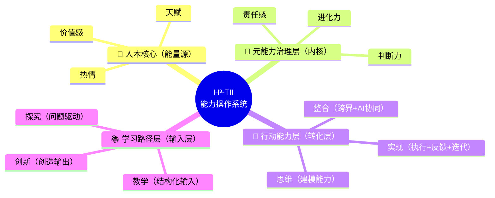

# H³-TII能力操作系统（H³-TII Human Capability Operating System）

## 元信息
- ID: CG11
- Engine: Cognition
- Layer: L5（升级：从L3→L5，这是一套人才培养操作系统，不是简单教学方法）
- Origin: original
- Source: 邱懿武·永乐学堂核心方法论
- 一句话定义：一套让人持续进化的能力操作系统——从"人"出发，而非从"能力"出发，定义三层能力结构+一核驱动+双循环的完整人才培养体系。

---

## 解决什么问题

没有这个方法时，人们通常犯的错：

1. **课程体系思维**：把教育等同于"教什么+怎么教"——只关注知识传递，不关注人的完整发展
2. **能力线性假设**：认为学习是"学了就会了"——忽略学习是一个闭环系统（教学→探究→创新→再教学）
3. **AI替代焦虑**：不知道在AI时代"什么值得教"——没有区分"AI能做的"和"只有人能做的"
4. **异化风险**：强能力但弱价值——培养出高效但无意义感的人

**核心问题**：当你需要设计一个人才培养体系（课程/项目/产品/Agent），如何确保"人不会被能力反噬"？

---

## 核心框架

### 整体架构：三层能力 + 一核驱动 + 双循环



### 一、三层能力结构（从外到内）

#### （1）学习路径层（Learning Path）—— 输入机制+认知升级

| 阶段 | 含义 | 时代逻辑 | 核心动作 |
|------|------|---------|---------|
| 教学 | 结构化知识输入 | 工业时代 | 接收、理解、记忆 |
| 探究 | 问题驱动学习 | 互联网时代 | 提问、搜索、验证 |
| 创新 | 创造输出 | AI时代核心 | 建模、整合、创造 |

**本质**：从"被动学习→主动理解→创造价值"的跃迁路径。创新不是天赋，而是训练路径的一部分。

#### （2）行动能力层（Action Abilities）—— 能力转化（把认知变成现实）

| 能力 | 含义 | 在AI时代的定义 |
|------|------|-------------|
| 思维 | 建模能力 | 把模糊问题变成可解的结构 |
| 整合 | 跨界+AI协同 | 人×AI×跨领域×多模型的智能编排能力 |
| 实现 | 执行+反馈+迭代 | 把脑子里的东西变成世界里的东西 |

**本质**：这是"智能编排能力"——AI时代的第一核心能力不是"会做"，而是"会整合会编排"。

#### （3）元能力治理层（Meta Abilities）—— 系统控制（操作系统内核）

| 元能力 | 含义 | AI时代的核心问题 |
|--------|------|---------------|
| 判断力 | 方向对不对 | AI能做很多，但"该不该做"只有人能判断 |
| 责任感 | 是否对结果负责 | 价值约束——不是什么能做都该做 |
| 进化力 | 是否持续升级 | 动态能力——今天的能力明天可能过时 |

**本质**：这是决定"你会不会用能力"的能力。大多数模型只做到知识→技能，H³-TII多了一层：判断/责任/进化。

### 二、人本核心（Human Core）—— 能量源

| 要素 | 含义 | 为什么放在核心 |
|------|------|-------------|
| 天赋 | 每个人与生俱来的独特优势 | 从"人"出发，不是从"岗位"出发 |
| 热情 | 让你持续投入的内在动力 | 没有热情的能力是消耗品 |
| 价值感 | "我做的事有意义"的感觉 | 保证"人不会被能力反噬" |

**本质**：这套模型不是从"能力"出发，而是从"人"出发——这和传统教育模型完全不同。在AI时代强调"人本核心"是为了避免异化：培养出高效但无意义感的人。

### 三、双循环

#### 学习-行动循环（右侧环）

```
教学 → 探究 → 创新 → 再教学
```

学习不是线性的，是一个闭环系统。创新产出本身就是下一轮教学的输入——"教是最好的学"。

#### 能力进化循环（内层环）

```
判断力 → 思维 → 整合 → 实现 → 反馈 → 进化力 → 判断力
```

元能力指导行动能力，行动结果反馈到元能力升级。

---

## 怎么用

### 场景1：诊断一个人的能力状态

**操作**：在四层结构中标注当前位置

| 层级 | 诊断问题 | 信号 |
|------|---------|------|
| 学习路径层 | TA主要处于哪个阶段？ | 只接收不提问→教学；会提问但不创造→探究；能创造输出→创新 |
| 行动能力层 | TA哪个能力最强/最弱？ | 能想不能做→思维强实现弱；能做不能整合→实现强整合弱 |
| 元能力治理层 | TA的判断/责任/进化如何？ | 方向感强但不负责→判断力强责任感弱；负责但不升级→责任感强进化力弱 |
| 人本核心 | TA的能量状态如何？ | 有能力但无热情→空转；有热情但无价值感→迷茫 |

**输出**：一张四层诊断图 + 短板定位 + 建议路径

### 场景2：设计一个课程/项目/培训体系

**操作**：确保四层全覆盖

| 必须覆盖的层 | 设计要点 |
|------------|---------|
| 人本核心 | 开始前先做天赋/热情评估（不是直接塞知识） |
| 学习路径层 | 教学→探究→创新三阶段都得有（不能只有教学） |
| 行动能力层 | 思维/整合/实现三个维度都要训练（不能只练思维） |
| 元能力治理层 | 必须有"判断力"和"责任感"的训练环节（不能只有技能） |

**检验**：如果一个课程只覆盖了学习路径层而没有其他层，它只是"教知识"，不是"培养人"。

### 场景3：设计一个AI教育产品/Agent

**操作**：四层映射到产品功能

| 层级 | 产品化方向 |
|------|----------|
| 人本核心 | 天赋/热情评估问卷 → 个性化起点 |
| 学习路径层 | 自适应学习路径推荐（教学/探究/创新三阶段） |
| 行动能力层 | 实战任务系统（思维→整合→实现的递进关卡） |
| 元能力治理层 | 成长报告+判断力挑战（决策场景模拟） |

---

## 诊断分级

| 等级 | 特征 | 状态 |
|------|------|------|
| ⭐⭐⭐⭐⭐ 完整操作系统 | 四层全覆盖+双循环运转+人本核心有能量 | 系统完整运转 |
| ⭐⭐⭐⭐ 能力完整 | 三层能力齐全但元能力治理层弱 | 能做事但方向感差 |
| ⭐⭐⭐ 能力偏科 | 只有行动能力层（能做）但缺其他层 | 高效工具人 |
| ⭐⭐ 有知识无能力 | 只有学习路径层（能学）但不转化 | 知识囤积者 |
| ⭐ 空转 | 四层都有但人本核心无能量 | 有能力但无意义感 |

---

## 案例

### 案例：用H³-TII设计一个"AI时代产品经理"培养方案

**人本核心**：先评估——你对产品工作的天赋在哪（逻辑/审美/共情）？你的热情来自哪里（解决用户问题/推动商业增长/打造好产品）？你的价值感来源是什么？

**学习路径层**：
- 教学阶段：产品方法论输入（用户画像、KANO、MVP等）
- 探究阶段：用真实产品问题驱动学习（"这个功能为什么留存低？"）
- 创新阶段：自己定义并验证一个新产品

**行动能力层**：
- 思维训练：用户需求建模、竞争格局分析
- 整合训练：跨职能协作（设计×工程×商业）+ AI工具协同
- 实现训练：从原型到上线的完整闭环

**元能力治理层**：
- 判断力：哪些需求值得做？什么时候该砍功能？
- 责任感：对用户负责还是对数据负责？冲突时怎么选？
- 进化力：如何持续更新自己的产品观？

---

## 常见陷阱

### 陷阱1：只做学习路径层，忽略其他层
**表现**：设计了一个"很好"的课程，全是知识输入+练习
**问题**：只培养了"知识搬运工"，没有培养"人"
**正确做法**：四层必须全覆盖，尤其不能缺元能力治理层

### 陷阱2：把"整合能力"等同于"跨学科"
**表现**：让学生学多个学科就认为培养了整合能力
**问题**：真正的整合是"智能编排"——人×AI×跨领域×多模型协同
**正确做法**：整合能力的训练必须包含AI协同环节

### 陷阱3：忽略人本核心
**表现**：直接从能力层开始训练，不问天赋/热情/价值感
**问题**：培养出高效但空转的人——有能力但无意义感
**正确做法**：必须从人本核心开始，先搞清楚"你是谁"再训练"你能做什么"

---

## 方法关系

- **前置**：CG01（AI认知五阶模型）——先定位认知深度，再用H³-TII设计成长路径
- **后续**：CG04（十级创造力评估）——用H³-TII培养后，用CG04评估成长
- **后续**：CG03（认知组装者方法）——H³-TII的"整合能力"训练目标就是培养认知组装者
- **并行**：PD06（AI产品定义九宫格）——H³-TII（做人）× 九宫格（做产品）= 完整体系

---

## 深度理解

### 这不是教育模型，是"人层操作系统"

现在懿武有三套核心体系：
1. **产品定义九宫格**（做产品）
2. **AI认知工程**（做系统）
3. **H³-TII**（做人）

H³-TII属于"人层操作系统（Human Layer OS）"——它定义的不是"教什么"，而是"如何构建一个人，如何持续进化"。

### 与AI时代的关系

**AI能做的，都不值得教。** H³-TII的元能力治理层（判断力×责任感×进化力）恰恰是AI做不到的——AI能做很多，但"该不该做"只有人能判断。"整合能力"就是AI时代的第一核心能力——不是"会做"，而是"会编排"。

### 产品化方向

1. **Agent形态**：「H³成长教练 Agent」——判断学生在哪一层、推荐路径、生成成长报告、动态调整训练策略
2. **游戏化结构**：三层关卡——学习路径=任务关卡、行动能力=实战关卡、元能力=Boss关卡（决策/选择）
3. **数据化评估**：成长评估引擎——思维能力指数、整合能力指数、判断力评分、进化速度
4. **IP化表达**：成长型IP宇宙——每个能力=一个角色（思维→分析型、整合→连接型、判断力→决策型）

### 升级建议

可以加一层**"环境/场域（Field）"**——四层结构变成：人→能力→路径→场域。因为"教育的核心是场域，而不是内容"。

### 一句话传播

**H³-TII不是一个教学方法，而是一套让人持续进化的能力操作系统。**
