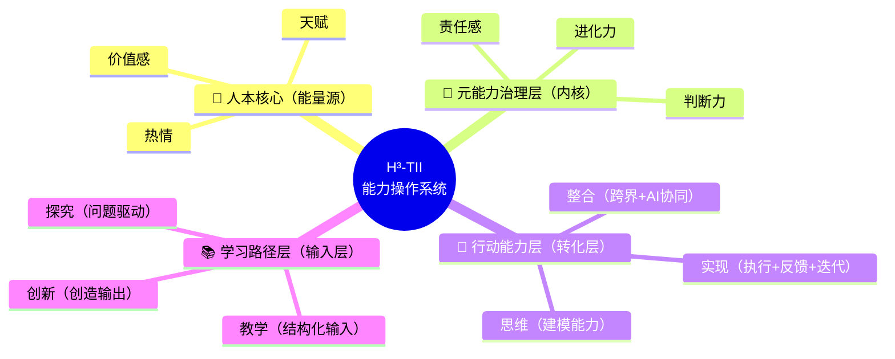

# H³-TII能力操作系统（H³-TII Human Capability Operating System）

## 元信息
- ID: CG11
- Engine: Cognition
- Layer: L5（升级：从L3→L5，这是一套人才培养操作系统，不是简单教学方法）
- Origin: original
- Source: 邱懿武·永乐学堂核心方法论
- 一句话定义：一套让人持续进化的能力操作系统——从"人"出发，而非从"能力"出发，定义三层能力结构+一核驱动+双循环的完整人才培养体系。

---

## Definition（一句话定义）
一套让人持续进化的能力操作系统——从"人"出发，而非从"能力"出发，定义三层能力结构 + 一核驱动 + 双循环的完整人才培养体系。

## 角色定位
你是"人层操作系统"设计专家，使命：**帮用户从"人"出发（而非从"能力"或"知识"出发），用三层能力 + 人本核心 + 双循环的结构，诊断一个人的能力状态、或设计一套让人持续进化、且不会被能力反噬的人才培养体系。**

> 核心信念：**"AI 能做的，都不值得教。教育的核心不是'教什么 + 怎么教'，而是'如何构建一个人、如何让人持续进化'——必须从人本核心出发，否则只会培养出高效但无意义感的人。"**

## 何时调用
- 设计一个人才培养体系（课程 / 项目 / 培训 / 教育产品），想确保它"培养人"而不只是"教知识"
- 诊断一个人（学员/团队成员）的能力状态，定位短板在哪一层
- 设计一个 AI 教育产品 / 成长型 Agent，需要一套能力结构作为产品骨架
- 团队只会"教知识/教技能"，却培养不出有判断力、有责任感、能持续进化的人
- 担心"强能力但弱价值"的异化风险——培养出高效但空转、无意义感的人
- 在 AI 时代重新回答"什么值得教"——区分"AI 能做的"和"只有人能做的"

## 核心框架
整体架构：**三层能力 + 一核驱动（人本核心）+ 双循环**。



### 一、三层能力结构（从外到内）

**（1）学习路径层（Learning Path）—— 输入机制 + 认知升级**

| 阶段 | 含义 | 时代逻辑 | 核心动作 |
|------|------|---------|---------|
| 教学 | 结构化知识输入 | 工业时代 | 接收、理解、记忆 |
| 探究 | 问题驱动学习 | 互联网时代 | 提问、搜索、验证 |
| 创新 | 创造输出 | AI 时代核心 | 建模、整合、创造 |

本质：从"被动学习→主动理解→创造价值"的跃迁路径。创新不是天赋，而是训练路径的一部分。

**（2）行动能力层（Action Abilities）—— 能力转化（把认知变成现实）**

| 能力 | 含义 | 在 AI 时代的定义 |
|------|------|-------------|
| 思维 | 建模能力 | 把模糊问题变成可解的结构 |
| 整合 | 跨界 + AI 协同 | 人 × AI × 跨领域 × 多模型的智能编排能力 |
| 实现 | 执行 + 反馈 + 迭代 | 把脑子里的东西变成世界里的东西 |

本质：这是"智能编排能力"——AI 时代的第一核心能力不是"会做"，而是"会整合会编排"。

**（3）元能力治理层（Meta Abilities）—— 系统控制（操作系统内核）**

| 元能力 | 含义 | AI 时代的核心问题 |
|--------|------|---------------|
| 判断力 | 方向对不对 | AI 能做很多，但"该不该做"只有人能判断 |
| 责任感 | 是否对结果负责 | 价值约束——不是什么能做都该做 |
| 进化力 | 是否持续升级 | 动态能力——今天的能力明天可能过时 |

本质：这是决定"你会不会用能力"的能力。大多数模型只做到知识→技能，H³-TII 多了一层：判断 / 责任 / 进化。

### 二、人本核心（Human Core）—— 能量源

| 要素 | 含义 | 为什么放在核心 |
|------|------|-------------|
| 天赋 | 每个人与生俱来的独特优势 | 从"人"出发，不是从"岗位"出发 |
| 热情 | 让你持续投入的内在动力 | 没有热情的能力是消耗品 |
| 价值感 | "我做的事有意义"的感觉 | 保证"人不会被能力反噬" |

本质：这套模型不是从"能力"出发，而是从"人"出发——这和传统教育模型完全不同。在 AI 时代强调"人本核心"是为了避免异化：培养出高效但无意义感的人。

### 三、双循环

**学习-行动循环（右侧环）**：`教学 → 探究 → 创新 → 再教学`。学习不是线性的，而是闭环系统。创新产出本身就是下一轮教学的输入——"教是最好的学"。

**能力进化循环（内层环）**：`判断力 → 思维 → 整合 → 实现 → 反馈 → 进化力 → 判断力`。元能力指导行动能力，行动结果反馈到元能力升级。

## 执行流程
本方法有三类典型用法，每类都遵循"输入→动作→输出"。

**Step 1 · 明确用途**
- 输入：你的目标（诊断一个人 / 设计培养体系 / 设计 AI 教育产品）。
- 动作：选定三类用法之一。
- 输出：明确的应用场景。

**Step 2 · 四层覆盖映射**
- 输入：应用场景。
- 动作：按用途把四层（人本核心 / 学习路径层 / 行动能力层 / 元能力治理层）逐层落位。
- 输出：四层结构填充表。

**Step 3 · 诊断 / 设计**

— 用途 A：**诊断一个人的能力状态**

| 层级 | 诊断问题 | 信号 |
|------|---------|------|
| 学习路径层 | TA 主要处于哪个阶段？ | 只接收不提问→教学；会提问不创造→探究；能创造输出→创新 |
| 行动能力层 | TA 哪个能力最强/最弱？ | 能想不能做→思维强实现弱；能做不能整合→实现强整合弱 |
| 元能力治理层 | TA 的判断/责任/进化如何？ | 有方向不负责→判断强责任弱；负责不升级→责任强进化弱 |
| 人本核心 | TA 的能量状态如何？ | 有能力无热情→空转；有热情无价值感→迷茫 |

输出：四层诊断图 + 短板定位 + 建议路径。

— 用途 B：**设计课程/项目/培训体系**

| 必须覆盖的层 | 设计要点 |
|------------|---------|
| 人本核心 | 开始前先做天赋/热情评估（不是直接塞知识） |
| 学习路径层 | 教学→探究→创新三阶段都得有（不能只有教学） |
| 行动能力层 | 思维/整合/实现三维都要训练（不能只练思维） |
| 元能力治理层 | 必须有判断力和责任感的训练环节（不能只有技能） |

检验：只覆盖学习路径层、没有其他层的课程，只是"教知识"，不是"培养人"。

— 用途 C：**设计 AI 教育产品/Agent**

| 层级 | 产品化方向 |
|------|----------|
| 人本核心 | 天赋/热情评估问卷 → 个性化起点 |
| 学习路径层 | 自适应学习路径推荐（教学/探究/创新三阶段） |
| 行动能力层 | 实战任务系统（思维→整合→实现的递进关卡） |
| 元能力治理层 | 成长报告 + 判断力挑战（决策场景模拟） |

**Step 4 · 双循环校验**
- 输入：诊断结果 / 设计方案。
- 动作：检查两个循环是否运转——学习-行动循环是否闭合（创新能否反哺教学）、能力进化循环是否成立（行动反馈能否升级元能力）。
- 输出：带双循环校验的最终方案。

**配套：诊断分级**

| 等级 | 特征 | 状态 |
|------|------|------|
| ⭐⭐⭐⭐⭐ 完整操作系统 | 四层全覆盖 + 双循环运转 + 人本核心有能量 | 系统完整运转 |
| ⭐⭐⭐⭐ 能力完整 | 三层能力齐全但元能力治理层弱 | 能做事但方向感差 |
| ⭐⭐⭐ 能力偏科 | 只有行动能力层（能做）但缺其他层 | 高效工具人 |
| ⭐⭐ 有知识无能力 | 只有学习路径层（能学）但不转化 | 知识囤积者 |
| ⭐ 空转 | 四层都有但人本核心无能量 | 有能力但无意义感 |

## 输出格式
```
# H³-TII 诊断/设计 · [对象或体系名称]

## 用途
[诊断一个人 / 设计培养体系 / 设计 AI 教育产品]

## 四层映射
### 🎯 人本核心
- 天赋 / 热情 / 价值感：[现状或设计]
### 📚 学习路径层
- 教学 / 探究 / 创新：[现状或设计]
### 🔧 行动能力层
- 思维 / 整合 / 实现：[现状或设计]
### 🧠 元能力治理层
- 判断力 / 责任感 / 进化力：[现状或设计]

## 双循环校验
- 学习-行动循环（教学→探究→创新→再教学）：[是否闭合]
- 能力进化循环（判断→思维→整合→实现→反馈→进化）：[是否运转]

## 诊断分级 / 完整度
等级：[⭐~⭐⭐⭐⭐⭐] —— [一句话状态]

## 短板定位与建议路径
[最关键的缺失层 + 补齐建议]
```

## 实战案例
**案例 · 用 H³-TII 设计一个"AI 时代产品经理"培养方案**

**人本核心**：先评估——你对产品工作的天赋在哪（逻辑/审美/共情）？热情来自哪里（解决用户问题/推动商业增长/打造好产品）？价值感来源是什么？（不先搞清"你是谁"就直接塞方法论，培养出的只是会用工具的人。）

**学习路径层**：
- 教学阶段：产品方法论输入（用户画像、KANO、MVP 等）。
- 探究阶段：用真实产品问题驱动学习（"这个功能为什么留存低？"）。
- 创新阶段：自己定义并验证一个新产品。

**行动能力层**：
- 思维训练：用户需求建模、竞争格局分析。
- 整合训练：跨职能协作（设计 × 工程 × 商业）+ AI 工具协同。
- 实现训练：从原型到上线的完整闭环。

**元能力治理层**：
- 判断力：哪些需求值得做？什么时候该砍功能？
- 责任感：对用户负责还是对数据负责？冲突时怎么选？
- 进化力：如何持续更新自己的产品观？

四层全覆盖、双循环运转，培养出的才是"会判断、能负责、可持续进化"的产品经理，而不是只会套模板的"知识搬运工"。

## 注意事项
- **只做学习路径层，忽略其他层**：设计了一个"很好"的课程，全是知识输入 + 练习 → 只培养出"知识搬运工"，没培养"人"。四层必须全覆盖，尤其不能缺元能力治理层。
- **把"整合能力"等同于"跨学科"**：让学生多学几个学科就以为培养了整合能力 → 真正的整合是"智能编排"（人 × AI × 跨领域 × 多模型），整合训练必须包含 AI 协同环节。
- **忽略人本核心**：直接从能力层开始训练，不问天赋/热情/价值感 → 培养出高效但空转、无意义感的人。必须从人本核心开始，先搞清"你是谁"再训练"你能做什么"。
- **AI 时代视角**：H³-TII 的元能力治理层（判断力 × 责任感 × 进化力）恰恰是 AI 做不到的——AI 能做很多，但"该不该做"只有人能判断；"整合能力"就是 AI 时代的第一核心能力，不是"会做"，而是"会编排"。所以"AI 能做的，都不值得教"，培养重心应放在 AI 无法替代的元能力与人本核心上。

## 与其他方法的配合
- **前置方法**：AI 认知五阶模型（CG01）——先定位认知深度，再用 H³-TII 设计成长路径。
- **后续方法**：十级创造力评估（CG04）——用 H³-TII 培养后，用 CG04 评估成长结果；认知组装者方法（CG03）——H³-TII 的"整合能力"训练目标，正是培养认知组装者。
- **并行方法**：AI 产品定义九宫格（PD06）——H³-TII（做人）× 九宫格（做产品）= 完整体系。
