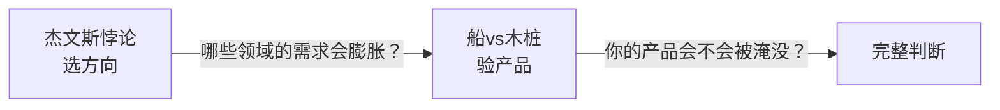
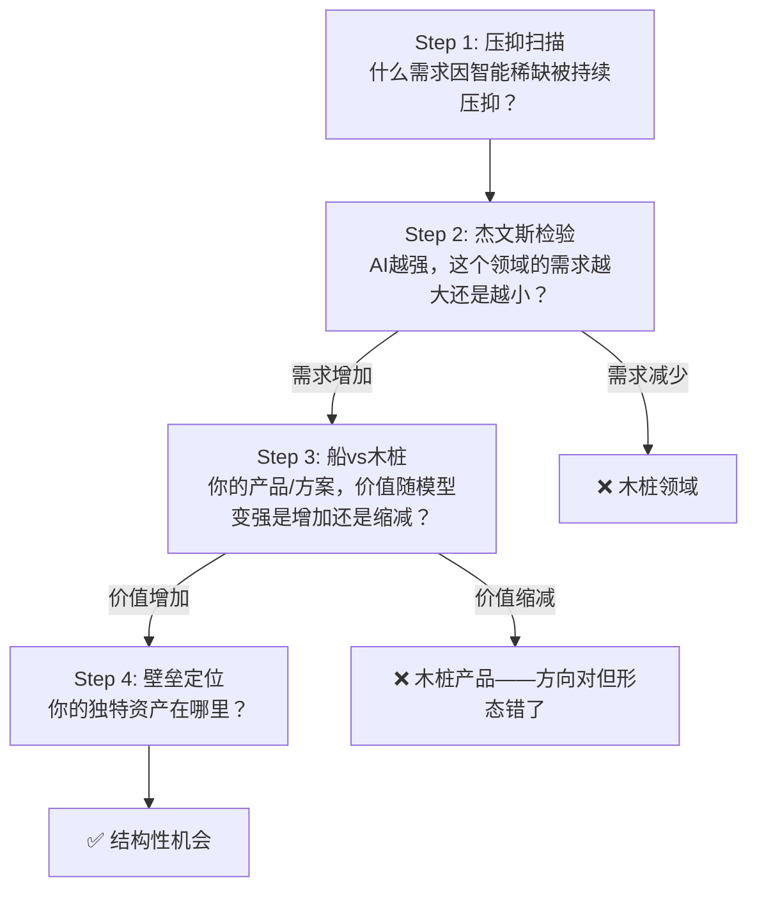

# 杰文斯悖论推理法（Jevons Paradox Opportunity Reasoning）

## 元信息
- ID: CG19
- Engine: Cognition
- Layer: L5
- Origin: original
- Source: 邱懿武《从杰文斯悖论看AI时代的六大结构性机遇》+《你做的AI产品，是木桩还是船？》（略懂AI，2026）
- 一句话定义：当智能变得越便宜越普及，什么需求会被激发得越多？——用"结论是被动的"原理推理AI时代的机会，并用"船vs木桩"检验具体产品的存活概率。

---

## 解决什么问题

没有这个方法时，人们通常犯的错：

1. **正向思维陷阱**：问"AI能做什么？"然后找场景——这导致所有机会都指向模型层，最终被更好的模型抹平
2. **替代焦虑**：认为AI变强=某些工作消失=需求减少——忽略了杰文斯悖论：效率提升反而激发更多需求
3. **技术驱动幻觉**：把机会锚定在技术本身（"我有AI能力"），而不是锚定在"因智能稀缺而被压抑的需求"

**核心问题**：当你面对一个AI时代的机会判断时，用这个方法检验它到底是"船"（会随AI变强而膨胀）还是"木桩"（会随AI变强而萎缩）。

---

## 核心框架

### 第一性原理：结论是被动的

> 每一次革命中，最大的机会从来不是"用新资源做旧事"，而是因新资源的丰裕，第一次具备实现可能的事。

杰文斯悖论的核心：蒸汽机出现并未减少对动力的需求，反而让人们发现上千种需要动力的事，是过去根本无力开展的。

同理：**AI不会降低人类对智能服务的需求，它只会揭示——在人类文明进程中，绝大多数人从未获得过足够的智能服务。**

### 两个框架的分工

- **杰文斯悖论**（宏观）：哪些领域因智能丰裕而需求爆发？→ 选对战场
- **船vs木桩**（微观）：你做的具体产品，价值随模型变强是增加还是缩减？→ 选对形态
- 两个都通过 → 结构性机会（"水涨船高"）
- 只有杰文斯通过 → 方向对但产品可能是木桩（"方向对但沉了"）
- 只有船通过 → 产品能活但市场不够大（"船很结实但海很小"）
- 都不通过 → 不值得做

### 四步推理框架

### 检验矩阵

| 检验维度 | 问题 | 船（值得做） | 木桩（不值得） |
|---------|------|-----------|-------------|
| 人类不变量 | 这个需求是否锚定在人性的不变需求上？ | 人永远需要专业帮助/真实/意义 | 依赖某个特定技术形态 |
| 杰文斯受益 | AI越强，这个需求越大还是越小？ | 越大（如：AI越强，真伪鉴别越需要） | 越小（如：AI越强，Prompt工程越不需要） |
| 船vs木桩 | 你的产品价值来自"填补模型缺口"还是"模型之上的独特资产"？ | 壳内的用户/数据/生态无法被带走 | 填补的缺口终将被模型原生覆盖 |
| 壁垒位置 | 核心竞争力在模型层还是模型外？ | 交付架构/信任体系/制造网络/文化深度 | 依赖模型能力本身 |

---

## 怎么用

### Step 1：压抑扫描

**输入**：一个行业/领域/需求

**操作**：问一个问题——"在智能长期稀缺的时代，这个领域里什么是被压抑的？"

**判断标准**：
- 被压抑的特征：大多数人"并非不需要，而是无力承担"
- 量化信号：全球X亿人从未获得过合格的Y服务；专家时薪$300+意味着只有少数人能负担
- 输出：一句"压抑陈述"——"在这个领域，因为智能稀缺，XX需求被压缩到只有顶层N%的人能获得"

**示例**：
- 专业服务：全球约50亿人从未获得过合格的医疗诊断——不是不需要，是承担不起
- 信任体系：AI越强，"这是真的吗"越难回答——真实性从默认变成稀缺资源
- 物理产品：从想法到实物需要12-18个月+数十万成本——创意被制造门槛压抑

### Step 2：杰文斯检验

**输入**：Step 1的压抑陈述

**操作**：做一次思想实验——"假设AI能力再提升10倍，这个需求会变大还是变小？"

**判断标准**：
- 如果变大 → 通过检验（"船"）
- 如果变小 → 不通过（"木桩"）
- 如果不变 → 中性，需要结合其他维度判断

**关键追问**：
- "当AI能把这件事做到90分，人类对这件事的需求是增加还是减少？"
- 历史参照：当电力变得便宜，用电的设备不是变少了，是变多了——因为人们发现上千种过去"无力用电"的事

**示例**：
- ✅ AI诊断能力越强 → 人们发现有更多健康问题值得咨询 → 需求增加
- ✅ AI内容生成越强 → "这是AI写的还是人写的？"越难回答 → 信任需求增加
- ❌ AI提示词能力越强 → 用户不再需要学习Prompt工程 → 需求减少

### Step 3：船vs木桩检验

**输入**：通过Step 2检验的领域

**操作**：问——"18个月后，大模型能力再翻一倍，这个产品还有存在的必要吗？"

**核心判断**：木桩和船的区别不在于做什么，而在于价值从哪里来。

| 价值来源 | 木桩 | 船 |
|---------|------|----|
| 本质 | 填补模型能力缺口 | 模型之上的独特资产积累 |
| 模型变强时 | 缺口被填补，价值消失 | 资产杠杆更大，价值增加 |
| 赚的钱 | 时间差的钱 | 积累的钱 |
| 生命周期 | 数月到一年 | 长期 |

**船的三个标志**：
1. **锁定用户**：用户养成使用习惯、沉淀数据资产、构建社交关系，形成迁移成本
2. **沉淀场景知识**：积累特定业务场景的实操经验、行业数据、最佳实践，这是大模型不具备的专属资产
3. **搭建生态**：形成用户互动、内容积累、网络效应的社区生态

**判断标准**：
- "套壳不是问题，套在桩上才是问题。套在船上，就是战略。"
- 淘宝是物流与支付基础设施上的壳，微信是通信基础设施上的壳——壳内的用户关系、交易数据、网络效应无法被带走
- AI时代同样：大模型是基础设施，能积累独特资产的"壳"才是持久价值

**示例**：
- ❌ 木桩：AI翻译App——核心价值是"帮翻译通顺"，模型内置翻译后失去存在价值
- ✅ 船：AI翻译App——核心价值是"沉淀了你的翻译风格和专业术语库"，模型越强越好用
- ❌ 木桩：AI客服——"解答常见问题"，大模型零配置即可实现
- ✅ 船：AI客服——"沉淀了深层需求理解，能预判问题、推荐产品、形成用户洞察"

### Step 4：壁垒定位

**输入**：通过Step 2检验的机会

**操作**：问——"当更好的AI模型出现时，这个机会会被抹平吗？"

**判断标准**（壁垒必须在模型层之外）：

| 壁垒类型 | 来源 | 示例 |
|---------|------|------|
| 交付架构 | 重新设计服务的组织方式 | 医疗：不是做AI医生，是设计"AI诊断+人类判断+信任体系+持续监护"的完整架构 |
| 网络体系 | 需要多方参与才能运转 | 信任：内容溯源网络、身份确权网络、判断力信用体系 |
| 制造协调 | 物理世界的复杂性 | 产品：前端"欲望唤醒与翻译"+后端"柔性制造协调网络" |
| 协议标准 | 行业基础设施级能力 | 编排：智能体身份认证、支付协议、信用系统、争议解决 |
| 文化深度 | 无法被算法复制的东西 | 意义：帮助人类重新定义"何为唯有人类能完成的事" |
| 数据积累 | 需要时间沉淀的专有数据 | 生物：科学数据积累、临床试验设计经验 |

**输出**：明确指出壁垒在哪一层，以及为什么更好的模型无法抹平它。

---

## 诊断分级

| 等级 | 特征 | 建议 |
|------|------|------|
| ⭐⭐⭐⭐⭐ S级 | 四重检验全通过：杰文斯受益+是船+壁垒清晰+巨大压抑量 | 坚决投入，水涨船高 |
| ⭐⭐⭐⭐ A级 | 杰文斯受益+是船+壁垒方向明确但路径待验证 | 值得投入，需要小步验证 |
| ⭐⭐⭐ B级 | 杰文斯受益但船vs木桩不清晰（可能两者兼有） | 需要明确：你的独特资产到底是什么？ |
| ⭐⭐ C级 | 是船但杰文斯效应不明显（船很结实但海很小） | 谨慎——产品能活但市场天花板有限 |
| ⭐ D级 | 木桩（方向或形态都不对） | 不做，或明确只赚时间差的钱 |

---

## 案例

### 案例1：评估"AI教育辅导"这个机会

**Step 1：压抑扫描**
- 一对一高质量教育辅导只有富人能负担（私教时薪$50-200）
- 全球数十亿学生从未获得过个性化辅导
- 压抑陈述："个性化教育辅导被压缩到只有顶层5%的学生能获得"

**Step 2：杰文斯检验**
- AI辅导能力提升10倍 → 更多学生发现"原来我可以这样学" → 需求增加 ✅

**Step 3：船vs木桩**
- ❌ 木桩型AI辅导："帮学生解答题目"——模型变强后直接能做，不需要专用工具
- ✅ 船型AI辅导："沉淀了学生的学习路径数据、知识薄弱点图谱、个性化学习风格"——模型越强，数据资产的杠杆越大

**Step 4：壁垒定位**
- 壁垒在：交付架构 / 数据积累（学习行为数据→个性化路径→飞轮）/ 文化深度 ✅

**结论**：S级机会。但必须做成"船"——价值在数据积累和个性化路径，不在AI辅导本身。

### 案例2：评估一个AI设计工具

**Step 1：压抑扫描**
- 专业设计服务只有大企业负担得起（设计公司时薪$200+）
- 中小企业和个人几乎无法获得专业设计

**Step 2：杰文斯检验**
- AI设计能力越强 → 更多人发现自己需要设计 → 需求增加 ✅

**Step 3：船vs木桩**
- ❌ 木桩型：核心价值是"AI生成好看的设计图"——模型更新后原生就能生成
- ✅ 船型：核心价值是"从AI生成到实体商品按需定制到独立店铺到48小时供应链交付"——模型越强，生成质量越好，整条链路价值越大
- 关键洞察：产能是溢出的（一天能生成1000张图但客户一年只推几十款），真正的价值不在生产端，在商业化链路

**Step 4：壁垒定位**
- 壁垒在：供应链协调网络 / 用户社区 / 商业化链路设计 ✅

**结论**：方向对但必须做成船——价值在壳内的用户/数据/供应链，不在AI生成本身。

---

## 常见陷阱

### 陷阱1：把"模型层能力"当成壁垒
**表现**："我们有独家的AI模型，所以有壁垒"
**问题**：模型层终将商品化，独家模型的优势是暂时的
**正确做法**：问"当所有人都有同样强的模型时，你的壁垒在哪？"

### 陷阱2：忽略"压抑量"的大小
**表现**：发现了一个"AI能做得更好"的场景，就认为是机会
**问题**：不是所有被压抑的需求都有足够大的市场——有些需求被压抑是因为"本来就小众"
**正确做法**：量化压抑——"全球有多少人从未获得过这个服务？"

### 陷阱3：混淆"杰文斯受益"和"杰文斯替代"
**表现**："AI能做X了，所以X的需求会爆发"
**问题**：需要区分——是"X的需求爆发"还是"对X的需求转移到了别处"？
**正确做法**：问"AI做了X之后，人类会发现更多需要X的场景（受益），还是不再需要X了（替代）？"

---

## 方法关系

- **前置**：CG02（第一性原理分析）——先用第一性原理拆解行业，再用杰文斯推理法检验机会
- **后续**：ST03（护城河迁移理论）——识别出机会后，进一步分析壁垒如何迁移
- **后续**：ST06（蓝海战略）——确定机会后，设计价值创新路径
- **并行**：CG15（未来雷达图）——多维度扫描时，杰文斯推理法可以作为一个独立维度

---

## 深度理解

### "结论是被动的"的哲学含义

这句话的深层含义是：**你不决定机会在哪，是被压抑的需求决定机会在哪。**

大多数人的思维方式是主动的——"我想做什么"、"我能做什么"。但杰文斯悖论告诉我们，真正的大机会是被动发现的——你只需要问"什么东西因为太贵/太少而被压抑了"，然后等成本降到临界点，需求就会自然爆发。

你的工作不是创造需求，而是**识别压抑，然后在临界点到来时站在那里**。

### 历史验证

| 革命 | 被压抑的需求 | 爆发后的机会 |
|------|------------|------------|
| 电力革命 | 动力稀缺→工厂必须集中在水力资源旁 | 工厂解绑→单层结构→郊区化→整个现代经济 |
| 互联网革命 | 信息稀缺→需要中间商/专家/媒体 | 信息免费→电商/搜索/社交媒体 |
| AI革命 | 智能稀缺→大多数人没有专业服务 | 智能免费→？ |

每一次革命中，最大机会都不是"用新资源做旧事"（电力革命不是"更快的马"），而是"因新资源的丰裕，第一次具备实现可能的事"。

### 船vs木桩的本质区别

木桩和船的区别，不在于产业链层级，而在于**产品价值随基础模型能力增长是提升还是缩减**。

**木桩的价值来自填补模型能力缺口**：缺口被填补，价值便消失。就像在河里打木桩——水位不断上涨（模型能力持续增长），一旦漫过桩顶，木桩便被淹没。并非木桩变差了，而是水位抬升了。

**船的价值来自模型之上的独特资产积累**：模型越强，资产杠杆越大。壳内的用户、数据、生态无法被带走——淘宝是物流基础设施上的壳，微信是通信基础设施上的壳，没人指责它们是"套壳"，因为壳内沉淀了无法复制的核心资产。

**关键洞察**：产能是溢出的。AI在生产端的效率提升，远高于需求端的消化速度。技术再优秀，下游无法承接，产能就是浪费。所以真正的价值不在"AI能生成什么"，而在"AI生成之后的商业化链路"。

**木桩也能赚钱，但赚的是时间差的钱。船赚的是积累的钱。** 在水位每三个月涨一次的时代，可怕的不是做了木桩，而是做了木桩却误以为自己造的是船。
